## in Jenkins pipeline 

* install *jforg* plugin 

* set creadtional on *creadtional* section 
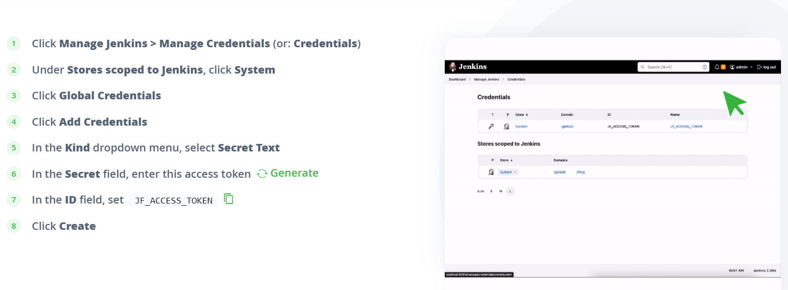
* configure the *jenkins plugin* on systems
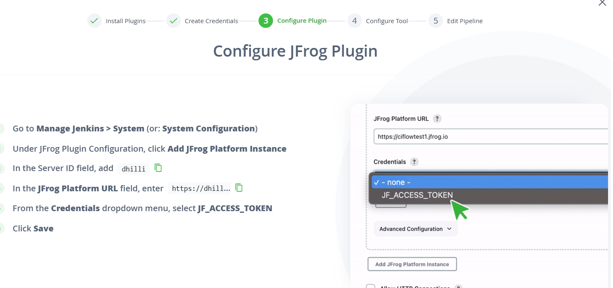
* Configure JFrog CLI as a *Jenkins Tool*section 
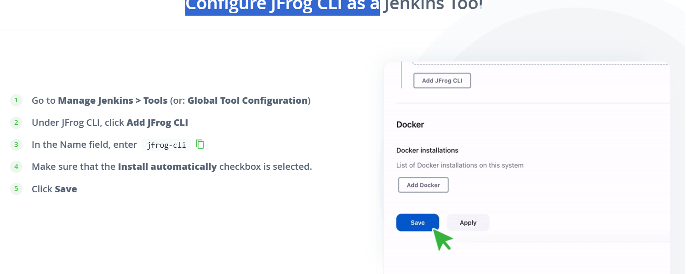

**key-points**
	- install `jforg` plugins on jenkins server
	- jfrog cli configure on `Tools` section give on auoto matically install
	- give on jforg creadtional `creadtional` sections like jforg `username` and `genarete-key`
	- in `system configure`on give on `jfrog-url`
	- in pipeline section give on `tools` name   

* write jenkin file 
```Jenkinsfile
pipeline {
	agent any
	tools {
		jfrog 'jfrog-cli'
	}
	environment {
		DOCKER_IMAGE_NAME = "dhilli.jfrog.io/<repo-name>/<image-name>:${BUILD_NUMBER}"
	}
	stages {
		stage('Clone') {
			steps {
				git branch: 'master', url: "https://github.com/jfrog/project-examples.git"
			}
		}

		stage('Build Docker image') {
			steps {
				sh 'docker image build -t $DOCKER_IMAGE_NAME'
			}
		}

		stage('Scan and push image') {
			steps {
				
					// Scan Docker image for vulnerabilities
					jf 'docker scan $DOCKER_IMAGE_NAME'

					// Push image to Artifactory
					jf 'docker push $DOCKER_IMAGE_NAME'
				}
			}
		

		stage('Publish build info') {
			steps {
				jf 'rt build-publish'
			}
		}
	}
}

```
# or push docker image 
- give that creadtionals on **JFROG** add the **jfrog urls**
- **mangejenkins> systems > jfrog** that sections add the **jfrg url**
```
pipeline {
    agent any
    environment {
        ARTIFACTORY_URL = 'https://<your-artifactory-domain>'
        ARTIFACTORY_REPO = 'docker-local'
        DOCKER_REGISTRY = '<your-artifactory-domain>:<port>'
        DOCKER_IMAGE = 'my-app'
        IMAGE_TAG = 'latest'
        CREDENTIALS_ID = 'jfrog-credentials-id' // Replace with Jenkins credential ID for JFrog
    }
    stages {
        stage('Checkout Code') {
            steps {
                checkout scm
            }
        }
        stage('Build Docker Image') {
            steps {
                script {
                    docker.build("${DOCKER_IMAGE}:${IMAGE_TAG}")
                }
            }
        }
        stage('Login to JFrog') {
            steps {
                script {
                    docker.withRegistry("https://${DOCKER_REGISTRY}", CREDENTIALS_ID) {
                        echo 'Logged in to JFrog Docker Registry'
                    }
                }
            }
        }
        stage('Tag Docker Image') {
            steps {
                script {
                    sh """
                    docker tag ${DOCKER_IMAGE}:${IMAGE_TAG} ${DOCKER_REGISTRY}/${ARTIFACTORY_REPO}/${DOCKER_IMAGE}:${IMAGE_TAG}
                    """
                }
            }
        }
        stage('Push Docker Image') {
            steps {
                script {
                    sh """
                    docker push ${DOCKER_REGISTRY}/${ARTIFACTORY_REPO}/${DOCKER_IMAGE}:${IMAGE_TAG}
                    """
                }
            }
        }
    }
    
}

```

## docker image push on jfrog on manuvally

* excute this steps `docker login -u <name_of_jf_user>` 

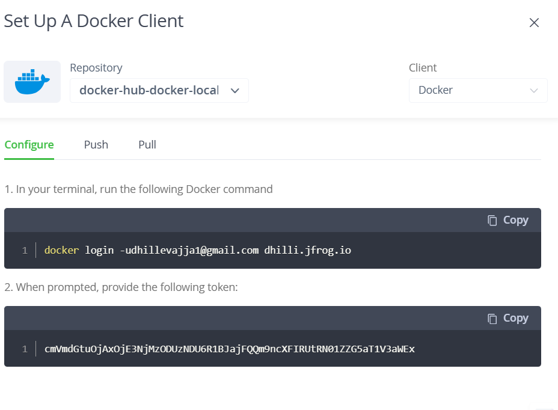
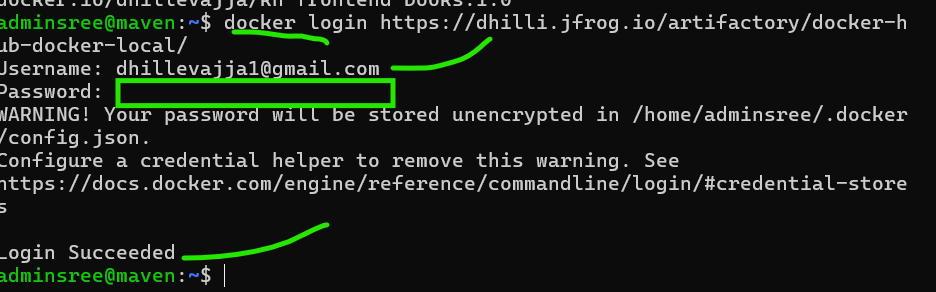

* tag the docker image on blow the commands 
```sh
docker tag <IMAGE_ID> dhilli.jfrog.io/docker-hub-docker-local/<DOCKER_IMAGE>:<DOCKER_TAG>
docker push dhilli.jfrog.io/docker-hub-docker-local/<DOCKER_IMAGE>:<DOCKER_TAG>
```
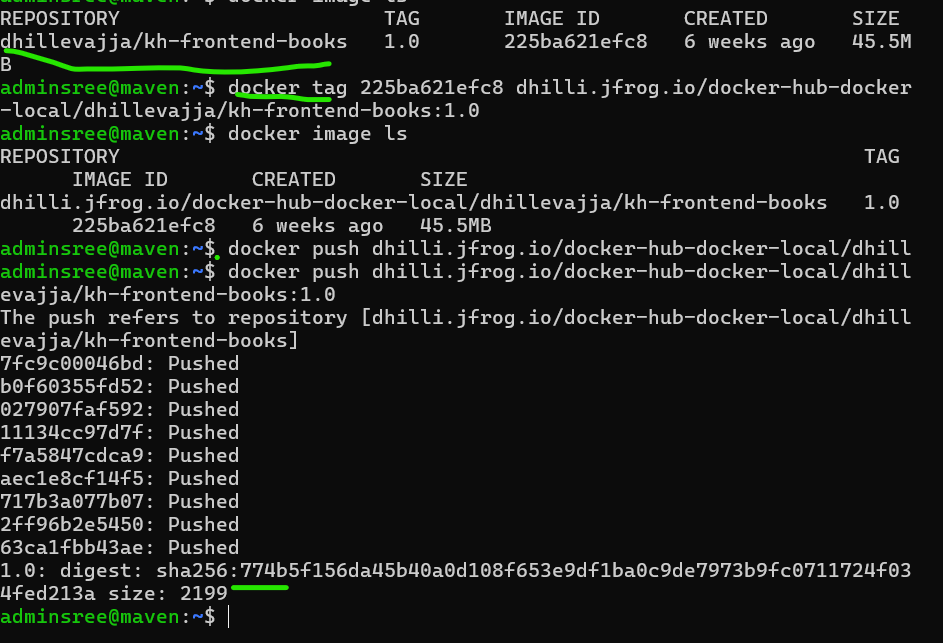

**Note:** you want to pull the docker image on jfrog repo 
* `docker pull <artifactory-url>/<repository-key>/<image-name>:<tag>` url means --> *dhilli.jforg.io*
* like `dhilli.jfrog.io/spc-jenkins-docker/spc:tag`
* check the image in *artifact>>repo-name> image name*

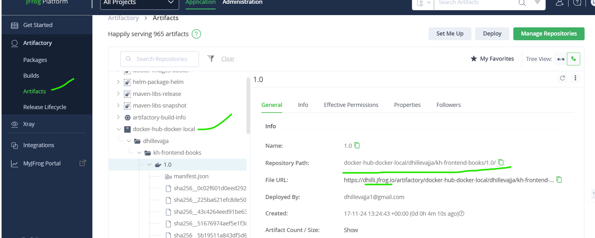
* pipeline is success fully excutations 
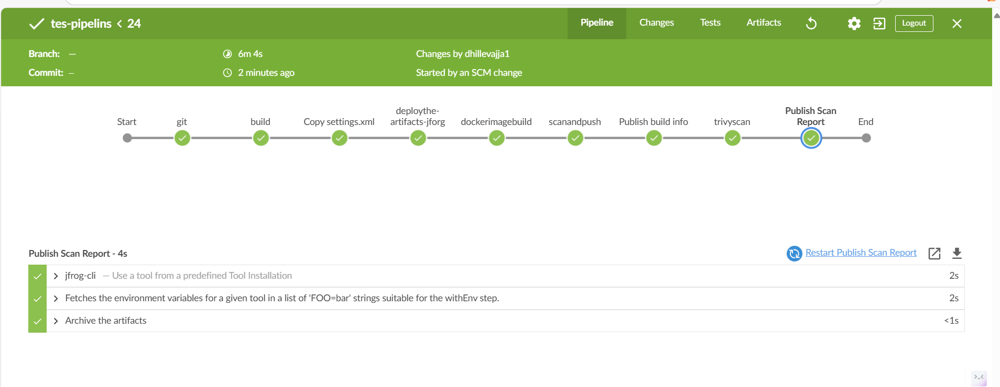
* check the docker images on jfrog account 
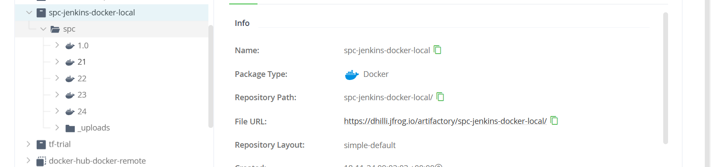
* scan the docker images on jfrog / check the reports on images
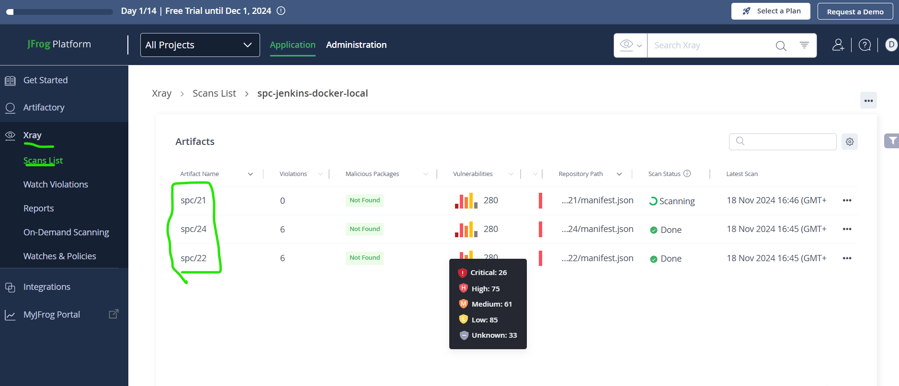
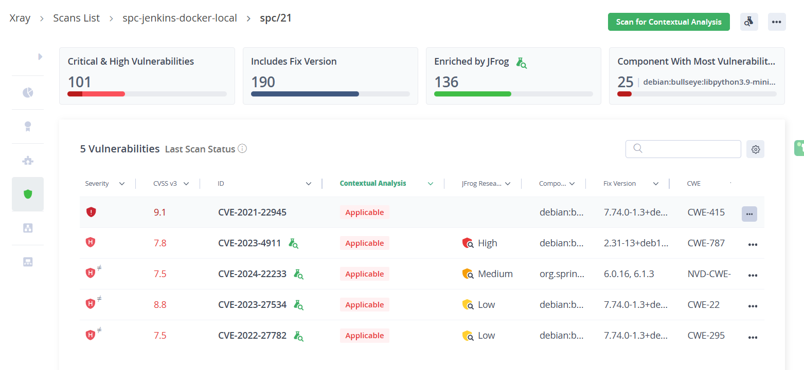

# store the jar/war file and push the docker image on jfrog server in azure pipeline 

## deploy the jar file
* create `settings.Xml` file
* modify the `pom.xml` file
* in `settings.xml` file store the *secure file* on azure DevOps
* **Libray** > **variables**> **securefiles**


### Step 1: Set Up JFrog Artifactory Account and Docker Repository
  * **Create a Docker repository** in your JFrog Artifactory account if you haven't done so.
  * Note the **repository URL**, **username,** and **password** (or an API key) for authentication.

### Step 2: Configure Service Connection in Azure DevOps (Optional)
  * To avoid including sensitive data directly in your YAML file, create a **Service Connection** in Azure DevOps for JFrog Artifactory.
  * Go to your Azure DevOps **Project > Project settings > Service connections > New service connection.**
  * Select **JFrog Artifactory** and provide the **URL, username, and password (or API key)**.
  * Name the service connection (e.g., `jfrog-service-connection`).

# Notes
* Ensure that your **JFrog credentials are securely stored** in Azure DevOps (either through a Service Connection or pipeline variables).
If you do not use a Service Connection, use pipeline variables to securely store your **JFrog URL, username, and password (or API key)**.
## 1. Use Azure DevOps Library (For Reusability)
If you plan to use the credentials across multiple pipelines, add them to a Variable Group:

  * Go to **Pipelines > Library > Variable Groups**.
  * **Click + Variable Group**.
  * Add variables `(JFROG_URL, JFROG_USER, JFROG_PASSWORD)` and mark sensitive ones as secret.
## 2. Add Credentials to Azure DevOps (Pipeline Variables)
**Step 1.1: Navigate to Pipeline Variables**
 * Go to your **Azure DevOps project**.
 * Navigate to **Pipelines > Your Pipeline > Edit**.
 * In the pipeline editor, click on the Variables tab.
**Step 1.2: Add JFrog Credentials**
Add the following variables:

  * **JFROG_URL:** Your JFrog Artifactory base URL (e.g., `https://artifactory.example.com`).
  * **JFROG_USER:** Your `JFrog username`.
  * **JFROG_PASSWORD:** Your `JFrog API key` or `password` (preferably an API key for better security).
__Make sure to:__

  * Check the Lock icon to mark `JFROG_PASSWORD` as secret.

### Step 3: Set Up Azure Pipeline YAML
In your pipeline YAML file, include the following steps:

**1.Log in to JFrog.**
**2.Build your Docker image.**
**3.Tag the Docker image.**
**4.Push the Docker image to JFrog Artifactory.**

* all changes in ci/cd server [Refer Here](https://github.com/dhille98/spring-petclinic.git) pipeline steps
### how to access on Kubernetes on jf account on docker images

* create a secret on k8s cluster 

```sh
kubectl create secret docker-registry regcred \
  --docker-server=<JFROG-HOSTNAME> \  # dhilli.jfrog.io
  --docker-username=<JFROG-USERNAME> \ 
  --docker-password=<PASSWORD> \  # create genaretive key
  --docker-email=<EMAIL> \ # optional
  --namespace=<NAMESPACE> # optional
```
