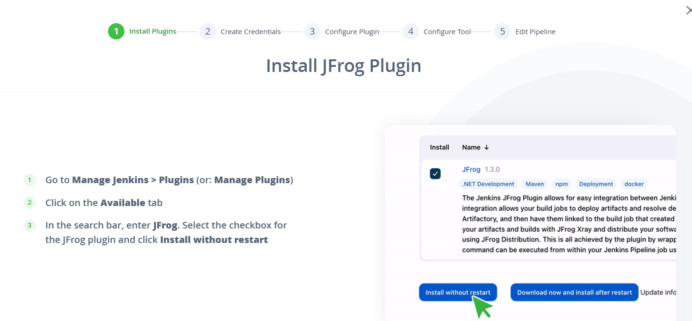

## in Jenkins pipeline 

* install *jforg* plugin 

* set creadtional on *creadtional* section 

* configure the *jenkins plugin* on systems

* Configure JFrog CLI as a *Jenkins Tool*section 


**key-points**
	- install `jforg` plugins on jenkins server
	- jfrog cli configure on `Tools` section give on auoto matically install
	- give on jforg creadtional `creadtional` sections like jforg `username` and `genarete-key`
	- in `system configure`on give on `jfrog-url`
	- in pipeline section give on `tools` name   

* write jenkin file 
```Jenkinsfile
pipeline {
	agent any
	tools {
		jfrog 'jfrog-cli'
	}
	environment {
		DOCKER_IMAGE_NAME = "dhilli.jfrog.io/<repo-name>/<image-name>:${BUILD_NUMBER}"
	}
	stages {
		stage('Clone') {
			steps {
				git branch: 'master', url: "https://github.com/jfrog/project-examples.git"
			}
		}

		stage('Build Docker image') {
			steps {
				sh 'docker image build -t $DOCKER_IMAGE_NAME'
			}
		}

		stage('Scan and push image') {
			steps {
				
					// Scan Docker image for vulnerabilities
					jf 'docker scan $DOCKER_IMAGE_NAME'

					// Push image to Artifactory
					jf 'docker push $DOCKER_IMAGE_NAME'
				}
			}
		}

		stage('Publish build info') {
			steps {
				jf 'rt build-publish'
			}
		}
	}
}
```

## docker image push on jfrog on manuvally

* excute this steps `docker login -u <name_of_jf_user>` 


* tag the docker image on blow the commands 
```sh
docker tag <IMAGE_ID> dhilli.jfrog.io/docker-hub-docker-local/<DOCKER_IMAGE>:<DOCKER_TAG>
docker push dhilli.jfrog.io/docker-hub-docker-local/<DOCKER_IMAGE>:<DOCKER_TAG>
```


**Note:** you want to pull the docker image on jfrog repo 
* `docker pull <artifactory-url>/<repository-key>/<image-name>:<tag>` url means --> *dhilli.jforg.io*
* like `dhilli.jfrog.io/spc-jenkins-docker/spc:tag`
* check the image in *artifact>>repo-name> image name*


* pipeline is success fully excutations 

* check the docker images on jfrog account 

* scan the docker images on jfrog / check the reports on images


### how to access on Kubernetes on jf account on docker images

* create a secret on k8s cluster 

```sh
kubectl create secret docker-registry regcred \
  --docker-server=<JFROG-HOSTNAME> \  # dhilli.jfrog.io
  --docker-username=<JFROG-USERNAME> \ 
  --docker-password=<PASSWORD> \  # create genaretive key
  --docker-email=<EMAIL> \ # optional
  --namespace=<NAMESPACE> # optional
```