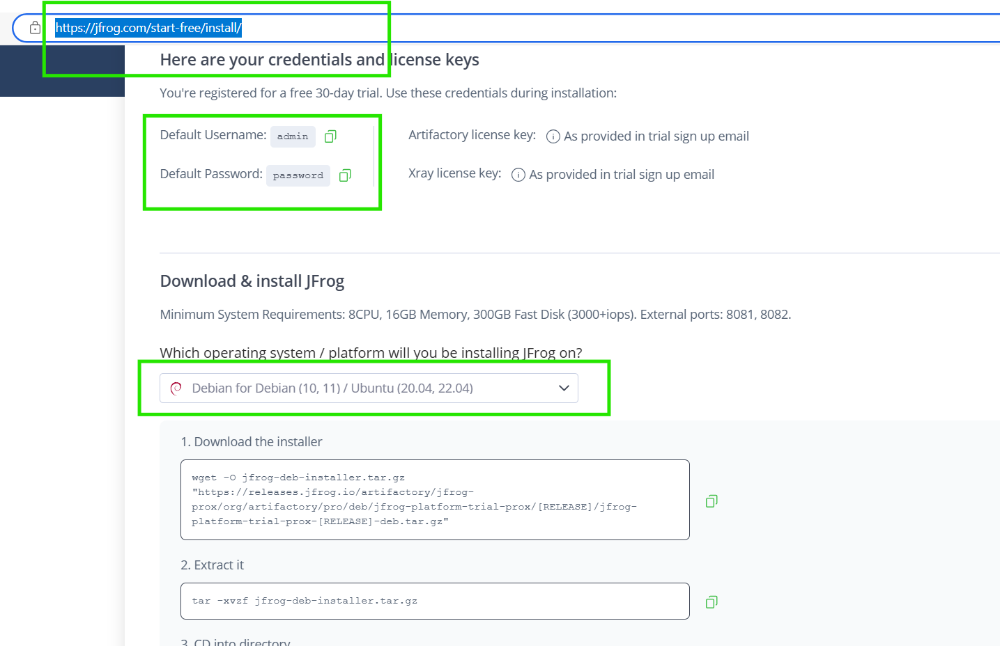
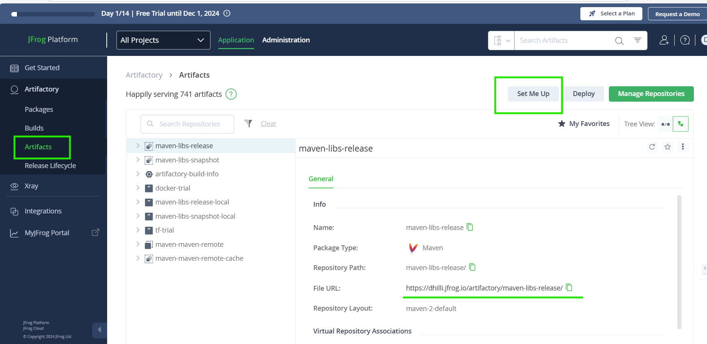
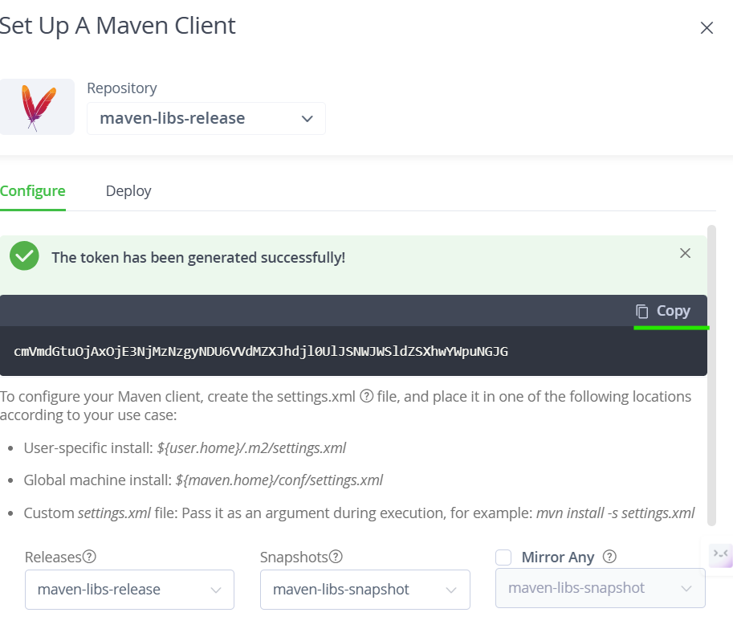
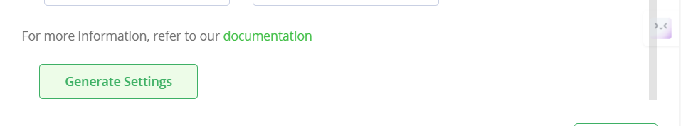
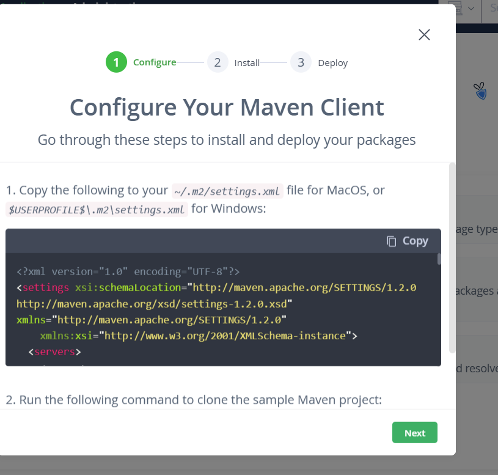
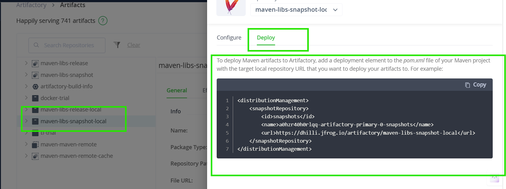
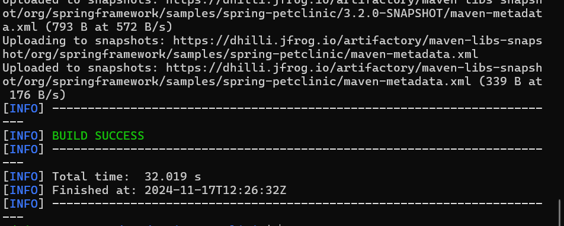
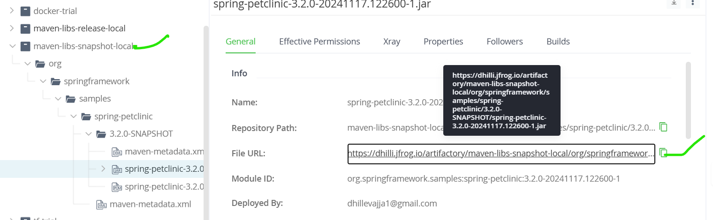

### Jfrog server free congiureations urls 

[Jfrog installations steps](https://jfrog.com/start-free/install/) 



```sh
    # 1. Download the installer
    wget -O jfrog-deb-installer.tar.gz "https://releases.jfrog.io/artifactory/jfrog-prox/org/artifactory/pro/deb/jfrog-platform-trial-prox/[RELEASE]/jfrog-platform-trial-prox-[RELEASE]-deb.tar.gz"

    # 2. Extract it
    tar -xvzf jfrog-deb-installer.tar.gz

    # 3.CD into directory
    cd jfrog-platform-trial-pro*

    # 4.Run the installer
    sudo ./install.sh

    # 5. Start Artifactory
    sudo systemctl start artifactory.service

    # 6. Start Xray
    sudo systemctl start xray.service

    # 7. Open your browser and go to:
    http://localhost:8082/
```

### create the jforg account deploy the jar/war file 
login that jforg account 
```
set up maven 
 libs-release-local 
  set me up 
 	* configure
	--> genarets token 
 	--> take that setting.xml file
		--> add user 
		--> add token
		--> copy that .m2 folder setting.xml file
	* deploy 
	copy the continent on pox.xml
		-->  add on properties section below and distribution Management above 
```

* create the jforg account and login [login](https://dhilli.jfrog.io/ui/login/)

* create the jfog account 
* step of the artifactory repo
* go to on `artifacts `

* genarete the token on `set up me`


* copy the file on .m2/setting.xml file

* copy the file on pom.xml file 


## maven application deploy 
* frist type command `mvn install` 
* creates the `.m2` folder on home directory 
* create the a `settings.xml` file on dir and modify the `pom.xml` file on 
* enter the command on `mvn deploy`

* check the aritifacts on 
