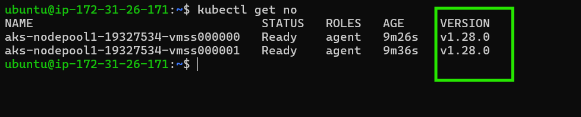
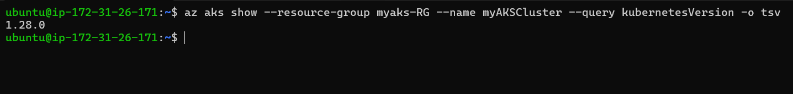
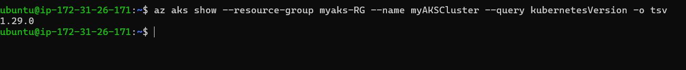
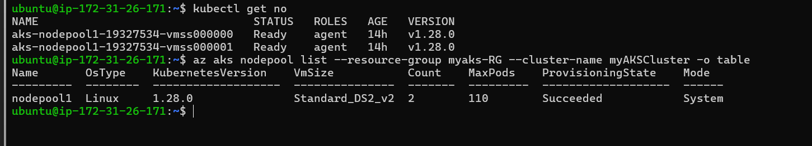
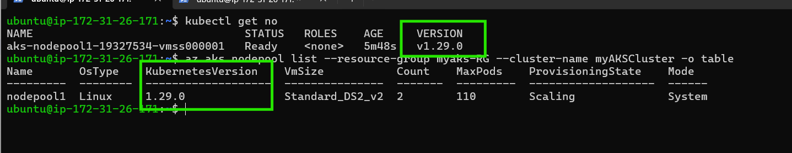
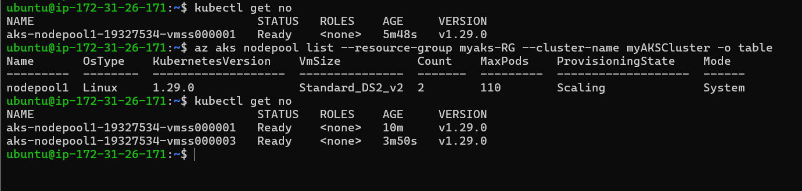

## upgrading aks cluster on 1.28 to 1.29 

* createing aks cluster on 1.28 version 
```sh
az group create --name myaks-RG --location eastus
az aks create \
  --resource-group myaks-RG \
  --name myAKSCluster \
  --node-count 2 \
  --kubernetes-version 1.28.0 \
  --generate-ssh-keys
```
* creating aks cluster 


To upgrade your Azure Kubernetes Service (AKS) cluster from version 1.28 to 1.29, follow these detailed steps:

## Pre-Upgrade Steps

1. **Check Compatibility**: Ensure that your applications are compatible with Kubernetes version 1.27. Review any breaking changes or deprecated features in the release notes.

2. **Backup Your Data**: It's advisable to back up your cluster data and configurations to prevent any data loss during the upgrade process.

3. **Identify Current Version**: Use the Azure CLI or the Azure portal to check your current AKS version:
   ```bash
   az aks show --resource-group myaks-RG --name myAKSCluster --query kubernetesVersion -o tsv
   ```


## Upgrade Process

### Step 1: Upgrade the Control Plane

1. **Initiate the Upgrade**: You can upgrade the control plane using the Azure CLI:
   ```bash
   az aks upgrade --control-plane-only --kubernetes-version 1.29.0 --name myAKSCluster --resource-group myaks-RG
   ```
   Replace `1.29.x` with the specific patch version you wish to upgrade to, or omit it to upgrade to the latest patch version.

2. **Confirm the Upgrade**: You will be prompted to confirm the operation. Type `y` to proceed.

* check the my app running or not during upgadation time 

```sh
#!/bin/bash
while true
do
  curl -sL http://52.225.21.60:3000/ | grep -i "<title>Todo App</title>"
  sleep 1s
done

```
* after upgrading the controll plan 


* in during upgradtation use run the shell scripti `./test.sh`
* no pockets loos on controll plan upgradtions 
  
1. **Create a New Node Pool**
Create a new node pool with the desired Kubernetes version (1.29):
```bash
az aks nodepool add \
  --resource-group <your-resource-group> \
  --cluster-name <your-cluster-name> \
  --name newnodepool \
  --kubernetes-version 1.29.0 \
  --node-count 2 \
  --node-vm-size Standard_DS2_v2
```

1. **Migrate Workloads to the New Node Pool**
To migrate your workloads, you can use labels and node selectors:

Label the new node pool:
```bash
kubectl label nodes -l agentpool=newnodepool nodePool=newnodepool
```
Patch your deployments to use the new node pool:

Replace <namespace> with your application's namespace.
```bash
kubectl get deployments -n <namespace> -o name | xargs -I {} kubectl patch {} -p '{"spec":{"template":{"spec":{"nodeSelector":{"nodePool":"newnodepool"}}}}}' -n <namespace>
```
Verify that pods are running on the new node pool:
```bash
kubectl get pods -n <namespace> -o wide
```

### Step 2: Upgrade Node Pools

After upgrading the control plane, you need to upgrade your node pools:

1. **Check Node Pools**: List your node pools to see their current versions:
   ```bash
   az aks nodepool list --resource-group myaks-RG --cluster-name myAKSCluster -o table
   ```


2. **Cordon the nodes**
once upgrading ready process 
```bash
 kubectl cordon <node> 
```

3. **Drain and Upgrade Old Node Pool**
Once all pods are confirmed to be running on the new node pool, you can drain and upgrade the old node pool:

Cordon and drain each node in the old pool:
```bash
kubectl drain <old-node-name> --ignore-daemonsets 
```
2. **Upgrade Node Pools**: For each node pool, run:
   ```bash
   az aks nodepool upgrade --resource-group myaks-RG --cluster-name myAKSCluster --name nodepool1 --kubernetes-version 1.29.0
   ```
   Again, replace `<nodepool-name>` with the name of your node pool and `1.29.x` with your desired patch version.

### Step 3: Validate the Upgrade

1. **Check Cluster Status**: After upgrading, verify that all nodes are in a `Ready` state:
   ```bash
   kubectl get nodes
   ```


2. **Test Your Applications**: Ensure that all applications are functioning as expected post-upgrade.



* in upgrading k8s cluster in azure during the upgradation aks create one `nodes` move to pods on that nodes after upgradtions success fully done node agin move to older node 
* above pitcher show that meaning 
* i am creating manuvally one node on aks cluster that name to assign to node on *0003*

## Additional Notes

- **Automatic Upgrades**: If you have automatic upgrades enabled, AKS may handle some of these steps for you.
- **Downtime Considerations**: While AKS manages node upgrades with minimal disruption, be prepared for potential downtime depending on your specific workload and configuration.
- **Documentation Reference**: For more detailed instructions and best practices, refer to [Microsoft's official documentation](3).

By following these steps, you can successfully upgrade your AKS cluster from version 1.28 to 1.29 while ensuring minimal disruption to your applications and services.
