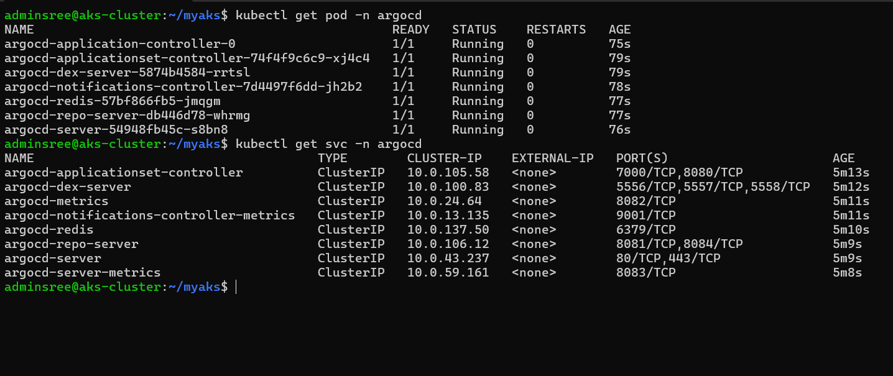
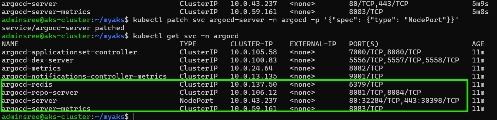

## ARGO - CD 
---------------

Argo CD is a Kubernetes-native continuous deployment (CD) tool.
 Unlike external CD tools that only enable push-based deployments, 
 Argo CD can pull updated code from Git repositories and deploy it directly to Kubernetes resources. 
 It enables developers to manage both infrastructure configuration and application updates in one system.


[Referhere](https://argo-cd.readthedocs.io/en/stable/?_gl=1*2ke5d1*_ga*NzU0MzM2NDAyLjE3MjM1NTA1NDA.*_ga_5Z1VTPDL73*MTcyMzU1MDU0MC4xLjAuMTcyMzU1MDU0MC4wLjAuMA..) configure with argo cd 

**Why Argo CD?¶**

Application definitions, configurations, and environments should be declarative and version controlled. Application deployment and lifecycle management should be automated, auditable, and easy to understand.

### Step-1

* create kubernetes cluster 
* Visit following URL for step-by-step deployment of ArgoCD [ReferHere](https://archive.eksworkshop.com/intermediate/290_argocd/install/)

### Deploying ArgoCD and Deploying application

**Note:** best pratice pupose using documentaion on installation on argocd 
 
```sh
    kubectl create namespace argocd
    kubectl apply -n argocd -f https://raw.githubusercontent.com/argoproj/argo-cd/stable/manifests/install.yaml
 
 ## arcd cli install
    VERSION=$(curl --silent "https://api.github.com/repos/argoproj/argo-cd/releases/latest" | grep '"tag_name"' | sed -E 's/.*"([^"]+)".*/\1/')

    sudo curl --silent --location -o /usr/local/bin/argocd https://github.com/argoproj/argo-cd/releases/download/$VERSION/argocd-linux-amd64

    sudo chmod +x /usr/local/bin/argocd
```

* after deploying argo cd checking the conmmands 
* `kubens` check the namaspace `argocd` and goto that name space `kubens argocd`
```sh
    kubectl get pods
    kubectl get svc
```


* after checking the svc in k8s 
* we set up on loadblance this is NLB in service file 
* setting svc on two types one is `path-file` , `ku edit svc` 
* anythore way is port-frowiding 
```sh
# port-forrding commands 
    kubectl port-forward svc/argocd-server --address 0.0.0.0 443:443
    # or 
    kubectl edit svc argocd-server -n argocd # change type: NodePort
    # or 
    kubectl patch svc argocd-server -n argocd -p '{"spec": {"type": "NodePort"}}'  # LoadBalancer
    kubectl patch svc argocd-server -n argocd -p '{"spec": {"type": "LoadBalancer"}}'
```
or 
```json

# kubectl patch svc argocd-server -n argocd --patch-file argo_nlb_patch.json
{
    "metadata": {
        "annotations": {
            "service.beta.kubernetes.io/aws-load-balancer-type": "nlb"
        }
    },
    "spec": {
        "type": "LoadBalancer" # NodePort
    }
}



```
* after creating for login svc check the NLB 
* login on the potral that NLB `https://`
* login and enter user details user is `admin`
```sh
    kubectl get secrets -n argocd
    kubectl describe secrets <name of secrets>-n argocd
    echo <passwd> | base64 -d

    # or

    kubectl -n argocd get secret argocd-initial-admin-secret -o jsonpath="{.data.password}" | base64 -d
```

[ReferHere](https://github.com/argoproj/argocd-example-apps) argocd examples 

### Adding GitHub Repo As Source Code:

Login to ArgoCD Console to add the git repo. Generate Public and Private **SSH Keys** in the Mgmt Server. Add Public Key to **Git Repo and Private Key** in Argocd.

cheking the : settings> repositary> ssh-keys

**next setp**

configure cluster id 

```sh
    Deploy The Application using ArgoCD CLI:

    export ARGOCD_SERVER=`kubectl get svc argocd-server -n argocd -o json | jq --raw-output .status.loadBalancer.ingress[0].hostname`

    argocd login $ARGOCD_SERVER --username admin --password <Password> --insecure

    kubectl config unset contexts.default

    CONTEXT_NAME=$(kubectl config view -o jsonpath='{.contexts[].name}')

    argocd cluster add $CONTEXT_NAME

```
creating secrets with TLS/SSL certifacts on **WC**
```sh
kubectl create secret tls nginx-tls --cert=tls.crt --key=tls.key -n default
kubectl create secret tls nginx-tls --cert=tls.crt --key=tls.key -n ingress-nginx


```
* Change domain name from k8sb26.xyz to yourdomain in ingress.yml

* Create 3 projects votingapp, rolingupdate & management-tools.

* Go to each Project and update SOURCE and destanations 
* these destinations  domians are `https://api.dhille.shop` and `https:kubenetes.defaults.svc`
* source domanis are `git hub repo urls`
* edit the culster level perimissions and namespace level permissins give all permissions 


* after that excute this commands `kubectl apply -f application.yaml`
* berfore excuations push the all code on **git hub** and **webhooks** are activted 
* applications file like 
```yaml
---
apiVersion: argoproj.io/v1alpha1
kind: Application
metadata:
  name: argoapps
  namespace: argocd
spec:
  syncPolicy:
    automated:
      selfHeal: true
      prune: true
      allowEmpty: true
  project: management-tools # our argo cd projects 
  source:
    repoURL: git@github.com:SreeVeerDevOps/k8sb26-argocd.git # our repositary urls
    targetRevision: HEAD
    path: ArgoApps # our yaml path on dirctory
  destination:
    server: https://kubernetes.default.svc 
    namespace: ingress-nginx # which name space deploy our applications 
```
### We can deploy individual applications from as repo as shown below.

                **OLD_REPO_CODE**
```sh
argocd app create rollingupdate --repo https://github.com/mavrick202/argocdtesting.git --path deploy  --dest-server https://k8sbatch17.xyz(Replace-with-ur-cluster) --dest-namespace default
 
argocd app create votingapp --repo https://github.com/mavrick202/argocdtesting.git --path votingapp  --dest-server https://api.trainingk8s.xyz --dest-namespace default
```
#################--NEW_REPO_CODE--###############

```sh
argocd app create rollingupdate --path  deploy \
--repo git@github.com:SreeVeerDevOps/k8sb26-argocd.git \
--dest-server https://api.k8sb26.xyz \
--dest-namespace default

argocd app create votingapp  --path  votingapp  \
--repo git@github.com:SreeVeerDevOps/k8sb26-argocd.git \
--dest-server https://api.k8sb26.xyz \
--dest-namespace default
```
above steps any dought using this file 
[ReferHere](https://docs.google.com/document/d/1zgX0peIOfQEz1GRs-3Zvz0BdW5xLcikm/edit?usp=drive_link&ouid=117011496037217770134&rtpof=true&sd=true)


## argocd set up on cli 

* install argocd cli
* [ReferHere][https://argo-cd.readthedocs.io/en/stable/getting_started/#1-install-argo-cd]
* instlations is complates 

```sh
    argocd login <ARGOCD_SERVER>
    username:
    passwd:
    # get the passwd 
    ku get secrets  -n argocd 
    ku get secrets 
    ku describe secrets argocd-initial-admin-secret -n argocd
    ku edit secrets argocd-initial-admin-secret -n argocd
    echo 'TU45aXRsRVVwTmQ5QXhxSQ==' | base64 -d

```
**Note:** if incase service is Loadblancer login with external IP `argocd login 35.12.45.98:30801`
            if service is NodePort login with node ip `ku get no -o wide` && `argocd login <NodePortIP/nodeIp>`

## argocd cli commands 

[ReferHere](https://argo-cd.readthedocs.io/en/stable/user-guide/commands/argocd/) all argocd cli commands 

```sh
    argocd app list
    
```