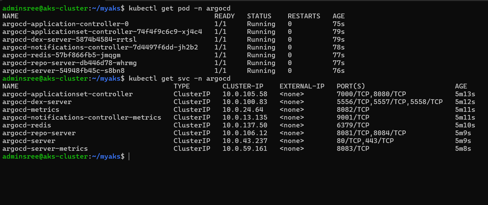

### argocd creation 

* [Refer Here](https://argo-cd.readthedocs.io/en/stable/?_gl=1*2ke5d1*_ga*NzU0MzM2NDAyLjE3MjM1NTA1NDA.*_ga_5Z1VTPDL73*MTcyMzU1MDU0MC4xLjAuMTcyMzU1MDU0MC4wLjAuMA..) offcial website

* blow commands excute
```sh
    kubectl create namespace argocd
    kubectl apply -n argocd -f https://raw.githubusercontent.com/argoproj/argo-cd/stable/manifests/install.yaml
```

