# VNG Set up on azure 
creating on vnet on subnet name is gateway subnet 


step-1:

- create a vng 
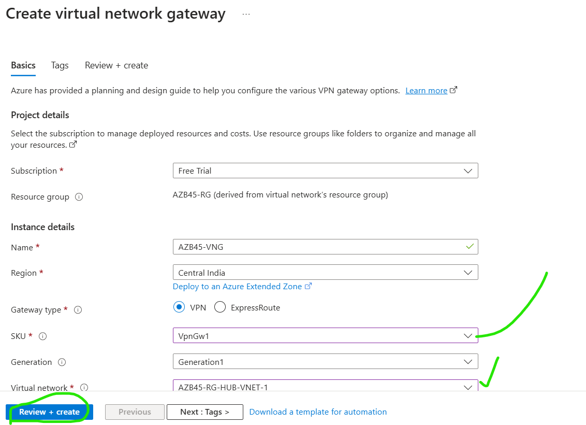
- create a monitor --> Diagnostic settings --> select on all logs 
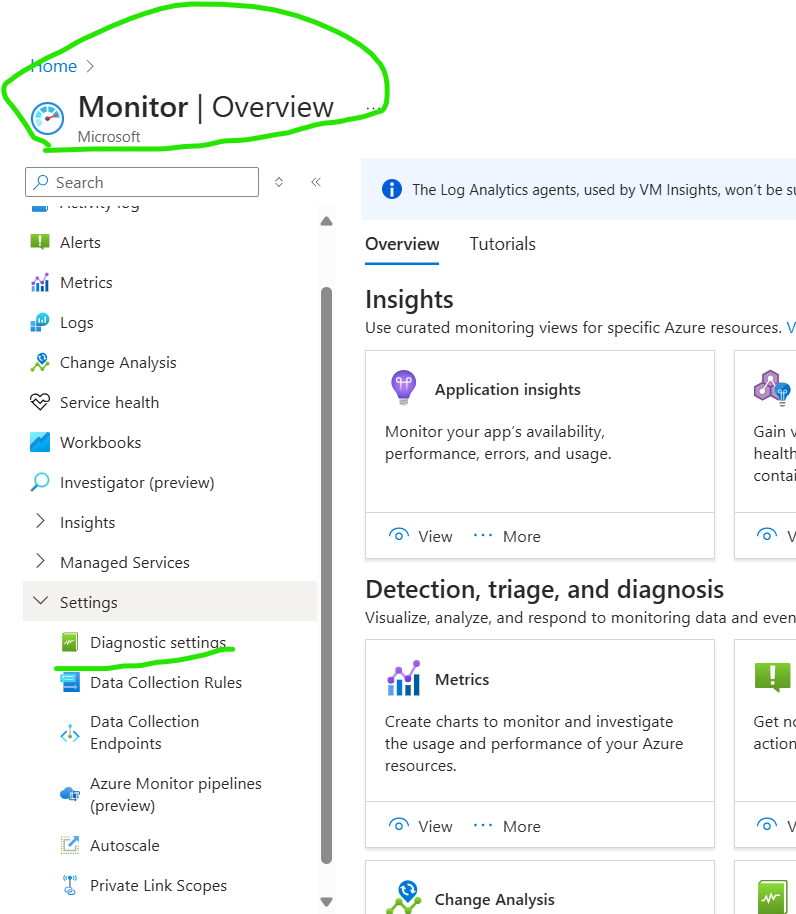
- create a log anlatics 
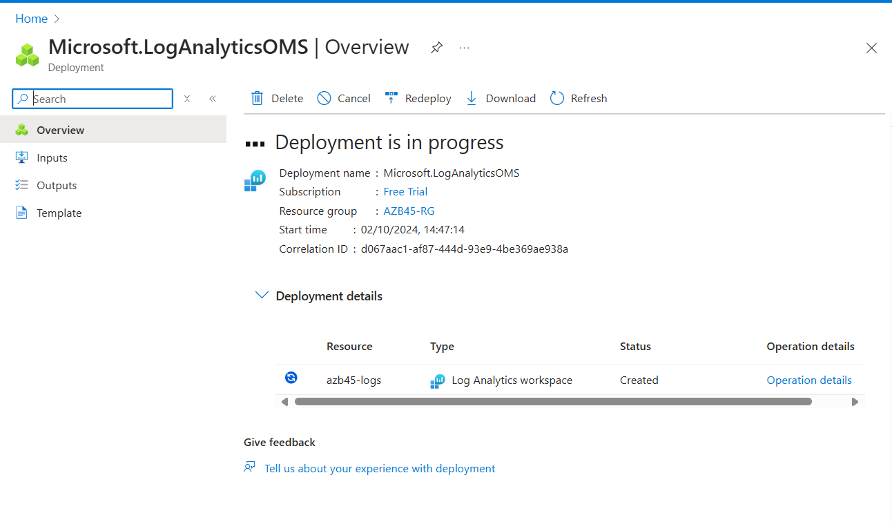
  
## aws create vpc 
step-2
- create vpc on aws and subnets 
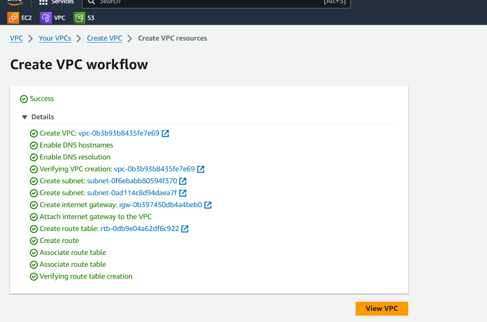 
- launch window server on aws 

- and install ad on that windows server
```powershell
ipconfig
ipconfig/all
ncpa.cpl
firewall.cpl

``` 


step-3

* create custmore gateway
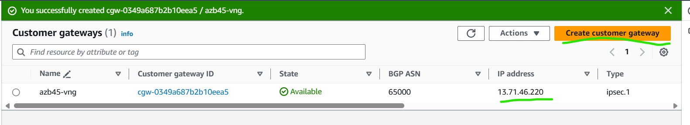 


* create a VPG on aws 
* 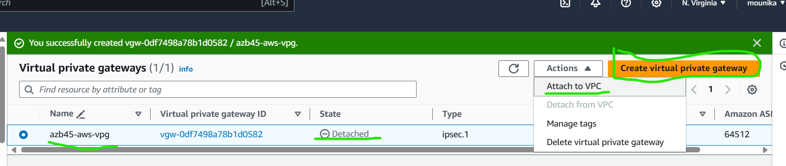
* set up on vpn conncetions on site to site 
* create on site to site connection
* 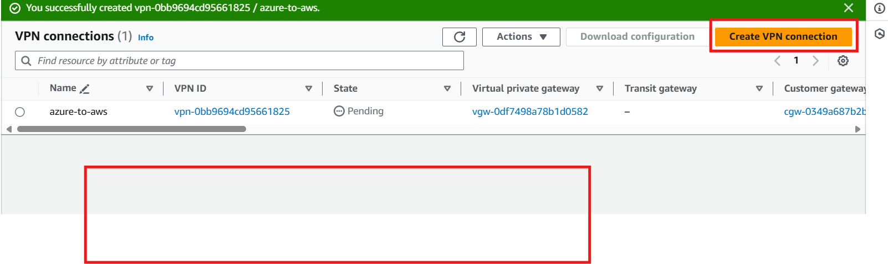
* download the configurations 


step-3

create vms on azure on windows servers 
```powershell
ipconfig
ipconfig/all
ncpa.cpl
firewall.cpl

``` 

step-4

* create a local netwok gate way 
* 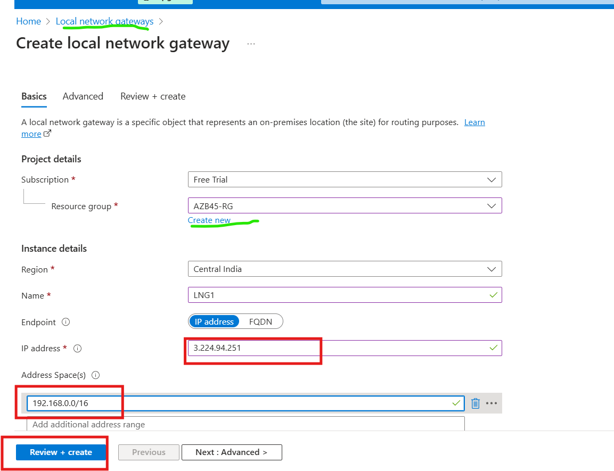
* BEST pritice two lng setup 

goto on vng on connections 

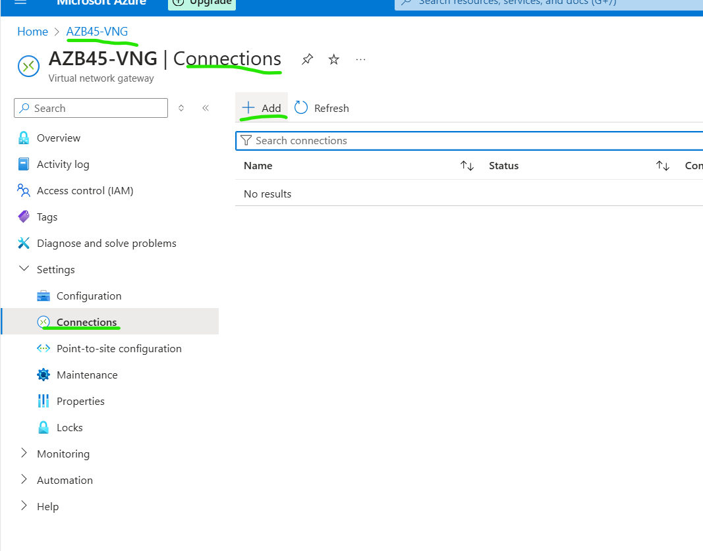

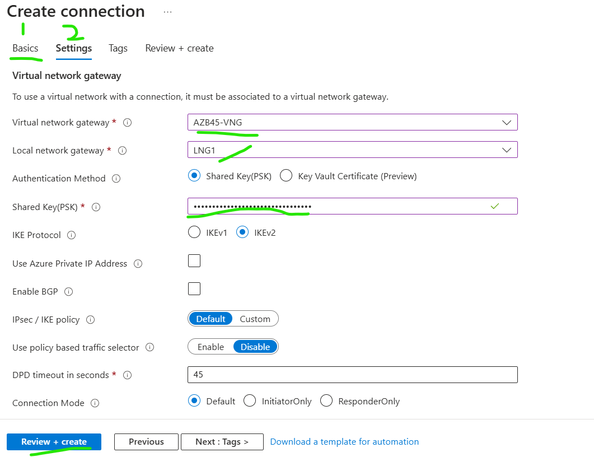
* edit the routing table in in aws add the azure vnet work address
* 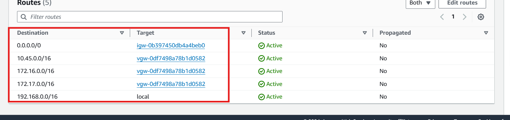

* every thing was correctly configured two tunnels are up 
  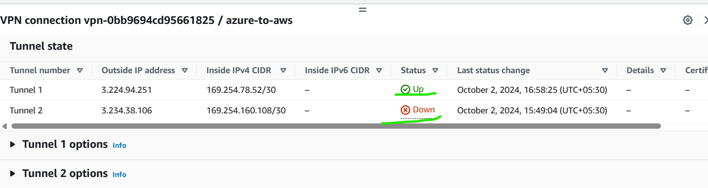
  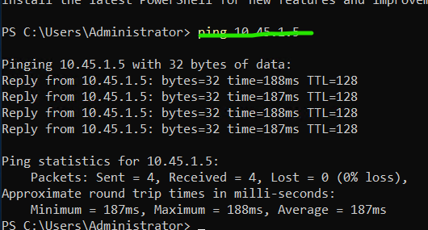
* after set up on azure 
* check the firewall status
* after the `sysdm.cpl` chenge to workgroup to domain


  